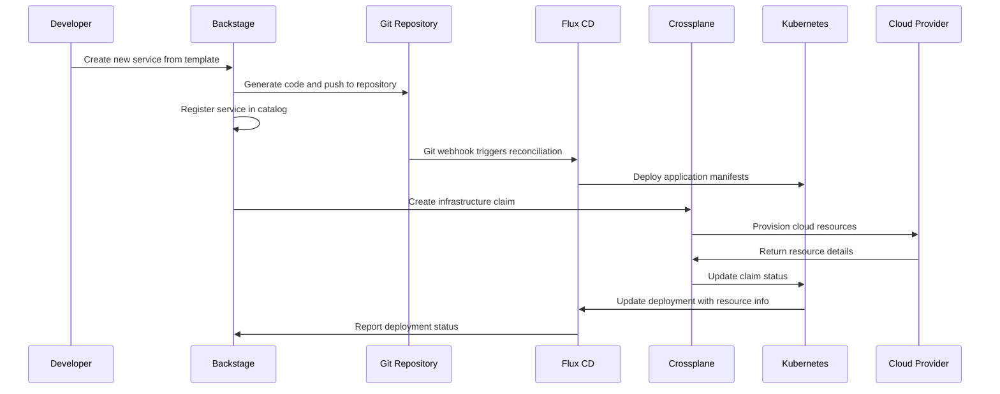
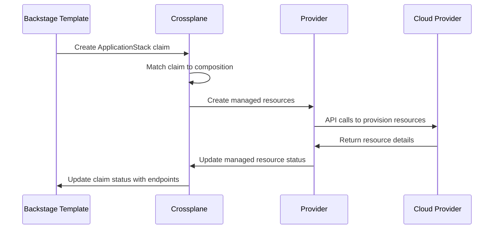
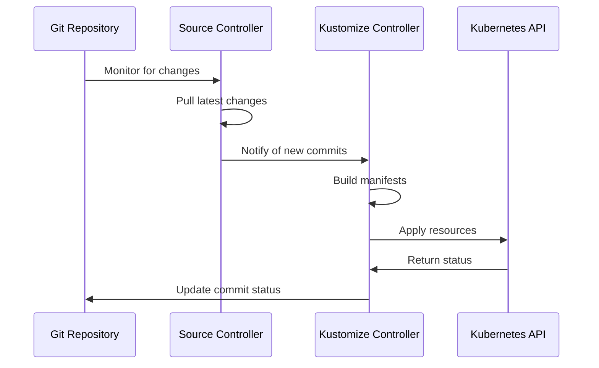

# Architecture Overview

This document provides a comprehensive overview of the Internal Developer Platform (IDP) architecture, its components, and how they work together to provide a seamless developer experience.

## High-Level Architecture

```
┌─────────────────────────────────────────────────────────────────┐
│                    DEVELOPER INTERFACE                         │
├─────────────────────────────────────────────────────────────────┤
│                      Backstage                                  │
│  ┌─────────────────┐ ┌─────────────────┐ ┌─────────────────┐   │
│  │   Catalog       │ │   Templates     │ │   TechDocs      │   │
│  │   Management    │ │   & Scaffolder  │ │   & Search      │   │
│  └─────────────────┘ └─────────────────┘ └─────────────────┘   │
├─────────────────────────────────────────────────────────────────┤
│                       AUTOMATION LAYER                         │
├─────────────────────────────────────────────────────────────────┤
│           Flux CD (GitOps)          │        Crossplane         │
│  ┌─────────────────┐ ┌─────────────┐ │ ┌─────────────────┐      │
│  │ Source Control  │ │ Kustomize   │ │ │ Compositions    │      │
│  │ Git Repos       │ │ Deployments │ │ │ XRDs & Claims   │      │
│  └─────────────────┘ └─────────────┘ │ └─────────────────┘      │
├─────────────────────────────────────────────────────────────────┤
│                    INFRASTRUCTURE LAYER                        │
├─────────────────────────────────────────────────────────────────┤
│                    Kubernetes Cluster                          │
│  ┌─────────────────┐ ┌─────────────────┐ ┌─────────────────┐   │
│  │   Applications  │ │   Infrastructure│ │   Monitoring    │   │
│  │   Workloads     │ │   Resources     │ │   Observability │   │
│  └─────────────────┘ └─────────────────┘ └─────────────────┘   │
├─────────────────────────────────────────────────────────────────┤
│                      CLOUD PROVIDERS                           │
├─────────────────────────────────────────────────────────────────┤
│         AWS              │        GCP              │    Azure   │
│  ┌─────────────────┐     │ ┌─────────────────┐     │ ┌─────────┐ │
│  │ EC2, RDS, S3    │     │ │ GCE, SQL, GCS   │     │ │ VM, DB  │ │
│  │ VPC, IAM, etc.  │     │ │ VPC, IAM, etc.  │     │ │ etc.    │ │
│  └─────────────────┘     │ └─────────────────┘     │ └─────────┘ │
└─────────────────────────────────────────────────────────────────┘
```

## Core Components

### 1. Backstage (Developer Portal)

**Purpose:** Provides a unified interface for developers to discover, create, and manage services and infrastructure.

**Key Features:**
- **Software Catalog:** Central registry of all software assets
- **Templates & Scaffolding:** Standardized project creation
- **TechDocs:** Documentation as code
- **Search & Discovery:** Find services, APIs, and documentation
- **RBAC:** Role-based access control

**Components:**
```
Backstage
├── Frontend (React.js)
│   ├── Catalog Browser
│   ├── Template Engine
│   ├── TechDocs Viewer
│   └── Search Interface
├── Backend (Node.js)
│   ├── Catalog API
│   ├── Scaffolder API
│   ├── TechDocs API
│   └── Auth Provider
└── Database (PostgreSQL)
    ├── Catalog Entities
    ├── User Sessions
    └── Scaffolder History
```

### 2. Crossplane (Infrastructure as Code)

**Purpose:** Manages cloud infrastructure using Kubernetes APIs and custom resources.

**Key Features:**
- **Declarative Infrastructure:** Define infrastructure as Kubernetes resources
- **Multi-Cloud Support:** AWS, GCP, Azure, and more
- **Composition Engine:** Abstract complex infrastructure patterns
- **Policy Enforcement:** Apply organizational policies

**Components:**
```
Crossplane
├── Core Controller
│   ├── Composition Engine
│   ├── Resource Controller
│   └── Policy Engine
├── Providers
│   ├── AWS Provider
│   ├── GCP Provider
│   ├── Azure Provider
│   └── Kubernetes Provider
└── Custom Resources
    ├── XRDs (Definitions)
    ├── Compositions
    └── Claims
```

### 3. Flux CD (GitOps)

**Purpose:** Ensures the desired state in Git is continuously reconciled with the cluster state.

**Key Features:**
- **Git-based Deployments:** Source of truth in Git repositories
- **Continuous Reconciliation:** Automatic drift detection and correction
- **Multi-tenant Support:** Namespace isolation and RBAC
- **Progressive Delivery:** Canary and blue-green deployments

**Components:**
```
Flux CD
├── Source Controller
│   ├── GitRepository CRD
│   ├── HelmRepository CRD
│   └── Bucket CRD
├── Kustomize Controller
│   ├── Kustomization CRD
│   └── Dependency Management
├── Helm Controller
│   ├── HelmRelease CRD
│   └── Chart Management
└── Notification Controller
    ├── Alerts
    └── Webhooks
```

### 4. Observability Stack

**Purpose:** Provides monitoring, logging, and alerting for the platform and applications.

**Components:**
```
Observability
├── Prometheus
│   ├── Metrics Collection
│   ├── Service Discovery
│   └── Alerting Rules
├── Grafana
│   ├── Dashboards
│   ├── Visualization
│   └── Alerting
└── Logging (Optional)
    ├── Fluent Bit
    ├── Elasticsearch
    └── Kibana
```

## Data Flow and Interactions

### 1. Developer Workflow



### 2. Infrastructure Provisioning



### 3. GitOps Reconciliation



## Security Architecture

### 1. Authentication & Authorization

```
┌─────────────────────────────────────────────────────────────┐
│                    Identity Providers                       │
│  ┌─────────────┐ ┌─────────────┐ ┌─────────────────────┐   │
│  │   GitHub    │ │   GitLab    │ │   Corporate LDAP    │   │
│  │   OAuth     │ │   OAuth     │ │   / Active Directory│   │
│  └─────────────┘ └─────────────┘ └─────────────────────┘   │
└─────────────────────────────────────────────────────────────┘
                              │
                              ▼
┌─────────────────────────────────────────────────────────────┐
│                      Backstage Auth                         │
│  ┌─────────────────┐ ┌─────────────────┐ ┌─────────────┐   │
│  │   Auth Backend  │ │   Permission    │ │   Catalog   │   │
│  │   Providers     │ │   Framework     │ │   RBAC      │   │
│  └─────────────────┘ └─────────────────┘ └─────────────┘   │
└─────────────────────────────────────────────────────────────┘
                              │
                              ▼
┌─────────────────────────────────────────────────────────────┐
│                   Kubernetes RBAC                          │
│  ┌─────────────────┐ ┌─────────────────┐ ┌─────────────┐   │
│  │   ClusterRoles  │ │   RoleBindings  │ │   Service   │   │
│  │   & Roles       │ │   & Users       │ │   Accounts  │   │
│  └─────────────────┘ └─────────────────┘ └─────────────┘   │
└─────────────────────────────────────────────────────────────┘
```

### 2. Network Security

- **Namespace Isolation:** Each team/project gets isolated namespaces
- **Network Policies:** Control traffic between pods and namespaces
- **TLS Everywhere:** Encrypted communication between all components
- **Service Mesh (Optional):** mTLS and advanced traffic management

### 3. Secrets Management

```
┌─────────────────────────────────────────────────────────────┐
│                External Secret Management                   │
│  ┌─────────────┐ ┌─────────────┐ ┌─────────────────────┐   │
│  │AWS Secrets  │ │   Vault     │ │   Azure Key Vault   │   │
│  │  Manager    │ │             │ │                     │   │
│  └─────────────┘ └─────────────┘ └─────────────────────┘   │
└─────────────────────────────────────────────────────────────┘
                              │
                              ▼
┌─────────────────────────────────────────────────────────────┐
│               External Secrets Operator                    │
│  ┌─────────────────┐ ┌─────────────────┐ ┌─────────────┐   │
│  │   SecretStore   │ │   External      │ │   Secret    │   │
│  │   Controllers   │ │   Secret CRDs   │ │   Sync      │   │
│  └─────────────────┘ └─────────────────┘ └─────────────┘   │
└─────────────────────────────────────────────────────────────┘
                              │
                              ▼
┌─────────────────────────────────────────────────────────────┐
│                 Kubernetes Secrets                         │
│  ┌─────────────────┐ ┌─────────────────┐ ┌─────────────┐   │
│  │   Application   │ │   Infrastructure│ │   Platform  │   │
│  │   Secrets       │ │   Credentials   │ │   Tokens    │   │
│  └─────────────────┘ └─────────────────┘ └─────────────┘   │
└─────────────────────────────────────────────────────────────┘
```

## Scalability Considerations

### 1. Horizontal Scaling

- **Backstage:** Multiple replicas with load balancer
- **Crossplane:** Distributed controllers across nodes
- **Flux:** Multi-tenancy with namespace isolation
- **Database:** Read replicas and connection pooling

### 2. Multi-Cluster Support

```
┌─────────────────────────────────────────────────────────────┐
│                Management Cluster                          │
│  ┌─────────────────┐ ┌─────────────────┐ ┌─────────────┐   │
│  │   Backstage     │ │   Crossplane    │ │   Flux CD   │   │
│  │   Control Plane │ │   Control Plane │ │   Multi-    │   │
│  │                 │ │                 │ │   Cluster   │   │
│  └─────────────────┘ └─────────────────┘ └─────────────┘   │
└─────────────────────────────────────────────────────────────┘
                              │
              ┌───────────────┼───────────────┐
              ▼               ▼               ▼
┌─────────────────┐ ┌─────────────────┐ ┌─────────────────┐
│ Development     │ │   Staging       │ │   Production    │
│ Cluster         │ │   Cluster       │ │   Cluster       │
│                 │ │                 │ │                 │
│ ┌─────────────┐ │ │ ┌─────────────┐ │ │ ┌─────────────┐ │
│ │ Workloads   │ │ │ │ Workloads   │ │ │ │ Workloads   │ │
│ └─────────────┘ │ │ └─────────────┘ │ │ └─────────────┘ │
└─────────────────┘ └─────────────────┘ └─────────────────┘
```

## Disaster Recovery

### 1. Backup Strategy

- **Backstage Database:** Regular PostgreSQL backups
- **Git Repositories:** Distributed nature provides backup
- **Kubernetes State:** etcd backups and velero snapshots
- **Cloud Resources:** Cross-region replication

### 2. Recovery Procedures

1. **Database Recovery:** Restore from PostgreSQL backup
2. **Cluster Recovery:** Restore from etcd backup or recreate
3. **GitOps Recovery:** Flux automatically reconciles from Git
4. **Infrastructure Recovery:** Crossplane recreates from claims

## Monitoring and Observability

### 1. Platform Metrics

- **Backstage:** API response times, user activity, template usage
- **Crossplane:** Resource creation success rate, reconciliation time
- **Flux:** Sync status, reconciliation frequency, error rates
- **Kubernetes:** Cluster health, resource utilization, pod status

### 2. Application Metrics

- **Custom Metrics:** Application-specific business metrics
- **Infrastructure Metrics:** Cloud resource utilization and costs
- **Performance Metrics:** Response times, throughput, error rates
- **Security Metrics:** Authentication failures, policy violations

### 3. Alerting Strategy

```
High Priority (P1) → Immediate Response
├── Platform components down
├── Security breaches
└── Data loss events

Medium Priority (P2) → Response within hours
├── Performance degradation
├── Failed deployments
└── Resource quota exceeded

Low Priority (P3) → Response within days
├── Configuration drift
├── Certificate expiration warnings
└── Capacity planning alerts
```

This architecture provides a robust, scalable, and secure foundation for an Internal Developer Platform that can grow with your organization's needs while maintaining developer productivity and operational excellence.