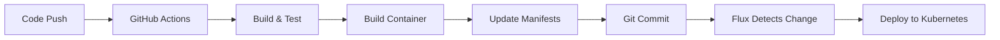

# Developer Guide

This guide helps developers understand how to effectively use the Internal Developer Platform (IDP) for creating, deploying, and managing applications and infrastructure.

## Getting Started as a Developer

### Accessing the Platform

1. **Open Backstage Portal**
   - URL: `http://localhost:3000` (or your configured domain)
   - Login with your GitHub/GitLab account

2. **Explore the Catalog**
   - Browse existing services and applications
   - Understand the software landscape
   - Find APIs and documentation

### Platform Overview for Developers

The IDP provides you with:
- 🏗️ **Self-Service Infrastructure:** Create databases, storage, and networking
- 🚀 **Standardized Templates:** Bootstrap applications with best practices
- 📊 **Observability:** Monitor your applications and infrastructure
- 📚 **Documentation:** Centralized technical documentation
- 🔍 **Discovery:** Find services, APIs, and team contacts

## Creating Your First Application

### 1. Using the Application Template

1. **Navigate to Templates**
   - Click "Create Component" in Backstage
   - Select "Application Infrastructure" template

2. **Fill in Details**
   ```yaml
   Name: my-awesome-app
   Description: My first application with the IDP
   Owner: my-team
   Environment: dev
   Region: us-west-2
   Include Database: Yes
   Storage Size: 20 GB
   ```

3. **Review and Create**
   - The template will:
     - Create a GitHub repository
     - Provision AWS infrastructure (VPC, S3, RDS)
     - Register the application in the catalog
     - Set up monitoring

### 2. What Gets Created

```
Repository Structure:
my-awesome-app/
├── .github/workflows/          # CI/CD pipelines
├── k8s/                       # Kubernetes manifests
├── infrastructure/            # Crossplane claims
├── docs/                      # Documentation
├── catalog-info.yaml          # Backstage metadata
├── README.md                  # Project documentation
└── app-config.yaml           # Application configuration
```

Infrastructure Created:
- **VPC** with public/private subnets
- **S3 Bucket** for storage
- **RDS PostgreSQL** database (if selected)
- **Security Groups** and networking
- **IAM Roles** and policies

## Creating Microservices

### 1. Using the Microservice Template

1. **Select Template**
   - Choose "Microservice Application"
   - This creates a production-ready service

2. **Configure Service**
   ```yaml
   Service Name: user-service
   Description: User management microservice
   Language: nodejs
   Framework: express
   Environment: dev
   Replicas: 2
   CPU: 100m
   Memory: 256Mi
   Enable Autoscaling: true
   ```

### 2. Generated Service Structure

```
user-service/
├── src/                       # Application source code
│   ├── controllers/
│   ├── models/
│   ├── routes/
│   └── app.js
├── tests/                     # Unit and integration tests
├── k8s/                       # Kubernetes deployment files
│   ├── deployment.yaml
│   ├── service.yaml
│   ├── hpa.yaml              # Horizontal Pod Autoscaler
│   └── ingress.yaml
├── .github/workflows/         # CI/CD pipeline
│   └── deploy.yml
├── Dockerfile                 # Container definition
├── package.json              # Dependencies
└── catalog-info.yaml         # Backstage metadata
```

### 3. Available Language Templates

| Language | Framework | Features |
|----------|-----------|----------|
| Node.js | Express | REST API, Health checks, Metrics |
| Python | FastAPI | REST API, Auto-docs, Async support |
| Java | Spring Boot | REST API, JPA, Actuator |
| Go | Gin | REST API, Performance, Small footprint |
| .NET | ASP.NET Core | REST API, Entity Framework |

## Working with Databases

### 1. Creating a Database

1. **Use Database Template**
   - Select "Database Service" template
   - Configure database specifications

2. **Database Configuration**
   ```yaml
   Database Name: user-db
   Owner: my-team
   Environment: dev
   Instance Class: db.t3.micro
   Storage Size: 20 GB
   Region: us-west-2
   Multi-AZ: false (for dev)
   ```

### 2. Connecting to Your Database

After creation, you'll receive:
- **Connection Secret** in Kubernetes
- **Endpoint URL** and port
- **Database credentials** (auto-generated)

Example connection in your application:
```javascript
// Node.js example
const connectionSecret = await k8s.getSecret('user-db-dev-postgres-conn');
const dbConfig = {
  host: connectionSecret.endpoint,
  port: 5432,
  database: 'postgres',
  username: connectionSecret.username,
  password: connectionSecret.password,
};
```

### 3. Database Management

- **Backups:** Automatic daily backups (configurable)
- **Monitoring:** Integrated with Grafana dashboards
- **Scaling:** Modify instance class through Crossplane claims
- **Security:** Encrypted at rest and in transit

## Deployment Workflows

### 1. GitOps Deployment Process



### 2. Deployment Environments

| Environment | Purpose | Promotion |
|-------------|---------|-----------|
| **dev** | Development and testing | Automatic on main branch |
| **staging** | Pre-production validation | Manual promotion |
| **prod** | Production workloads | Manual with approvals |

### 3. Promotion Workflow

1. **Development**
   ```bash
   git push origin feature-branch
   # Deploys to dev environment
   ```

2. **Staging Promotion**
   ```bash
   # Create PR to staging branch
   git checkout staging
   git merge main
   git push origin staging
   ```

3. **Production Promotion**
   ```bash
   # Create release tag
   git tag v1.0.0
   git push origin v1.0.0
   # Requires manual approval in GitHub
   ```

## Monitoring and Observability

### 1. Application Metrics

Your applications automatically get:
- **Health Checks:** `/health` endpoint monitoring
- **Metrics Collection:** Prometheus integration
- **Distributed Tracing:** Request tracking (if enabled)
- **Log Aggregation:** Centralized logging

### 2. Custom Metrics

Add custom metrics to your application:

```javascript
// Node.js with Prometheus client
const prometheus = require('prom-client');

const userRegistrations = new prometheus.Counter({
  name: 'user_registrations_total',
  help: 'Total number of user registrations',
  labelNames: ['method']
});

// Use in your code
userRegistrations.inc({ method: 'email' });
```

### 3. Dashboards

Access pre-built dashboards in Grafana Cloud:
- **IDP Overview:** Platform component health and metrics
- **Application Overview:** Request rates, latency, errors  
- **Infrastructure Overview:** CPU, memory, disk usage
- **Database Performance:** Connections, query performance
- **Business Metrics:** Custom application metrics

**Access:** Your Grafana Cloud URL (configured during setup)

## Troubleshooting Common Issues

### 1. Deployment Failures

**Check Flux Status:**
```bash
# See if Flux is syncing
kubectl get kustomizations -A

# Check specific deployment
kubectl describe kustomization my-app -n flux-system
```

**Check Application Logs:**
```bash
# View pod logs
kubectl logs -f deployment/my-app -n my-namespace

# Check events
kubectl get events --sort-by=.metadata.creationTimestamp -n my-namespace
```

### 2. Infrastructure Issues

**Check Crossplane Resources:**
```bash
# See managed resources
kubectl get managed

# Check specific claim
kubectl describe applicationstack my-app-dev
```

**Check Provider Status:**
```bash
# Verify providers are healthy
kubectl get providers
```

### 3. Access Issues

**Check RBAC:**
```bash
# Verify your permissions
kubectl auth can-i create pods --namespace my-namespace
```

**Check Service Connectivity:**
```bash
# Test service endpoints
kubectl run test-pod --image=nicolaka/netshoot -it --rm -- /bin/bash
```

## Best Practices

### 1. Application Development

- ✅ **Use Health Checks:** Implement `/health` and `/ready` endpoints
- ✅ **Graceful Shutdown:** Handle SIGTERM signals properly
- ✅ **Resource Limits:** Set appropriate CPU and memory limits
- ✅ **Environment Variables:** Use ConfigMaps and Secrets
- ✅ **Logging:** Use structured logging (JSON format)

### 2. Infrastructure Management

- ✅ **Use Templates:** Don't create infrastructure manually
- ✅ **Environment Separation:** Separate dev, staging, and prod
- ✅ **Resource Tagging:** Tag all cloud resources consistently
- ✅ **Cost Optimization:** Right-size resources for each environment
- ✅ **Security:** Follow principle of least privilege

### 3. Development Workflow

- ✅ **Feature Branches:** Use feature branches for development
- ✅ **Pull Requests:** Require code reviews
- ✅ **Automated Testing:** Include unit and integration tests
- ✅ **Documentation:** Keep README and docs updated
- ✅ **Versioning:** Use semantic versioning for releases

## Advanced Features

### 1. Custom Templates

Create your own Backstage templates:

```yaml
# templates/my-custom-template.yaml
apiVersion: scaffolder.backstage.io/v1beta3
kind: Template
metadata:
  name: my-custom-template
  title: My Custom Service
spec:
  parameters:
    # Define your parameters
  steps:
    # Define creation steps
```

### 2. API Integration

Integrate with external APIs:

```yaml
# catalog-info.yaml
apiVersion: backstage.io/v1alpha1
kind: API
metadata:
  name: user-api
spec:
  type: openapi
  definition: |
    # OpenAPI specification
```

### 3. Custom Crossplane Compositions

Create reusable infrastructure patterns:

```yaml
# crossplane/compositions/my-pattern.yaml
apiVersion: apiextensions.crossplane.io/v1
kind: Composition
metadata:
  name: my-pattern
spec:
  # Define your infrastructure pattern
```

## Getting Help

### 1. Self-Service Resources

- **Documentation:** Browse the docs/ directory
- **Catalog:** Search for similar services in Backstage
- **Templates:** Look at existing template examples
- **Grafana:** Check monitoring dashboards for insights

### 2. Team Support

- **Platform Team:** Contact via Slack #platform-support
- **Team Leads:** Reach out to your team's technical lead
- **Office Hours:** Join weekly platform office hours
- **GitHub Issues:** Create issues in the platform repository

### 3. Community Resources

- **Internal Wiki:** Company-specific documentation
- **Training Videos:** Recorded platform training sessions
- **Slack Channels:** Join relevant technology channels
- **Brown Bags:** Attend weekly tech talks

## Quick Reference

### Common Commands

```bash
# Check platform status
kubectl get pods -A | grep -E "(backstage|crossplane|flux)"

# View your applications
kubectl get applications -A

# Check Flux sync status
flux get sources git

# See Crossplane resources
kubectl get managed

# Port forward services
kubectl port-forward svc/backstage 3000:80 -n backstage
kubectl port-forward svc/grafana 3001:80 -n monitoring
```

### Important URLs

- **Backstage:** http://localhost:3000
- **Grafana:** http://localhost:3001
- **Platform Docs:** http://localhost:3000/docs
- **API Catalog:** http://localhost:3000/catalog?filters%5Bkind%5D=api

### Emergency Contacts

- **Platform Team Lead:** @platform-lead
- **On-Call Engineer:** Check #platform-support channel
- **Infrastructure Issues:** @infrastructure-team
- **Security Issues:** @security-team

Remember: The platform is here to make your life easier. Don't hesitate to ask for help or suggest improvements!